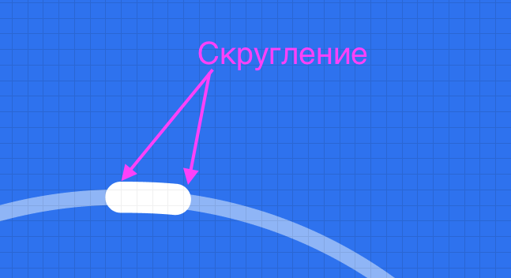
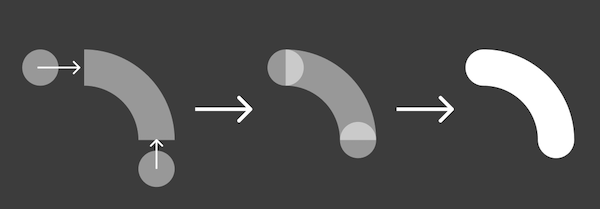
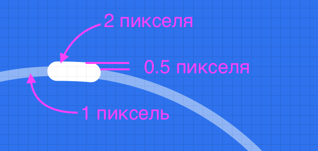
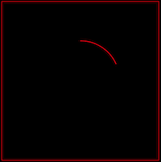

# Тестовое задание на верстку

## Требования

Сверстать блок на чистым HTML и CSS без JS/TS по
[макету](<https://www.figma.com/design/7PQeuuT4z8icQaxtff3Gln/%D0%A2%D0%B5%D1%81%D1%82%D0%BE%D0%B2%D0%BE%D0%B5-%D0%B7%D0%B0%D0%B4%D0%B0%D0%BD%D0%B8%D0%B5-(Stworka)?node-id=98-10642&t=5UF89AMUR65zdub6-1>) в фигме

## Выполненное задание

[Демо](https://sergeykardashev.github.io/Stworka-progress-checklist/) на GitHub Pages

## Реализация и сложности

Столкнулся с проблемой - радиальный прогресс-бар.
Возможные решения:

1. **Группа svg или png для каждого состояния**, т.е. по картинке на каждый шаг.
   **Недостаток** - много картинок и не гибкое решение.
2. **Спрайт из отдельных svg**.
   **Недостаток** - нужно для каждого состояния (шага) делать отдельный вектор. Не гибкое решение
3. **SVG с аркой**, длина которой соответствует проценту прогресса.
   **Недостаток** - без JS не получается.
4. **Кольцо с маской**. Маску вращать в зависимости от прогресса.
   **Недостаток** - не формирует скругления на концах прогресс-бара
5. **Див с двумя заливками**. У дива скруглены углы для получения круга. Первая заливка - радиальный градиент. Формирует кольцо из круга. Вторая заливка - конический градиент. Закрашивает прогресс.
   **Недостаток** - не формирует скругления на концах прогресс-бара и не получается гибко настраивать толщину линии прогресса. Выравнивать точно как в макете не получается.

## Сложности с прогресс-баром

### Скругления

Не получается сделать кругления как в макете.

Скругления - часть линии.

Я же реализовал сектор кольца не в виде линии, а в виде закрашивания конусным градиентом.

### Толщина линии сектора кольца

В макете линия прогресса толщиной в 2 пикселя, а линия траектории толщиной 1 пиксель. То есть с траектории должны "свисать" края по половинке пикселя. Так не бывает.

### Идеи

Можно попробовать сделать svg с просчетом двух координат конца точки через calc.
Интерактивный аналог - [тут](http://xahlee.info/js/svg_circle_arc.html).

Можно подвигать слайдеры и посмотреть как меняются сразу 2 координаты, когда меняешь sweep.
Чтобы получить сектор кольца примерно в 30 градусов, нужно выставить параметры типа `<path d=" M 200 100 A 100 100 -90 0 1 291 159" />`
В интерактивном примере это

- Start angle: 0;
- Sweep: 66;
- Rotation: -90;
